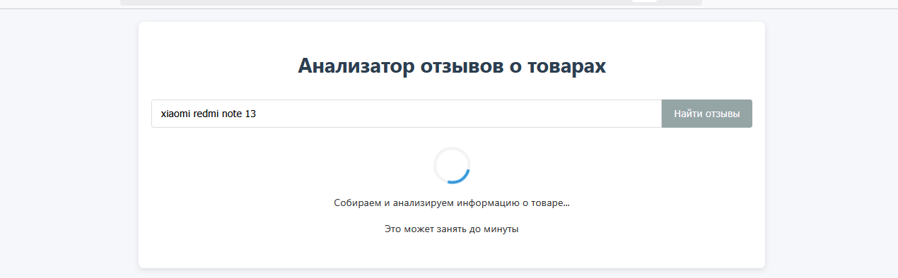
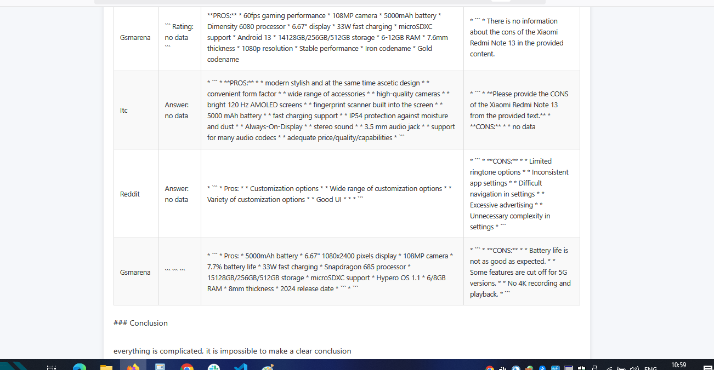

# Product Review Analyzer  

This project is a web application that allows users to search for and analyze reviews of any products on the internet. The application uses search engines to collect links to review pages, Playwright to load content, and a language model (Llama) to analyze text and extract information.

## Features

1. **Product Search**: Users can enter a product name, and the application will find and analyze online reviews.

2. **Review Collection**: Uses Playwright to load content from review pages, handling dynamically loaded content.
3. **Data Cleaning & Processing**: Extracts review content and removes unnecessary HTML tags.
4. **Review Analysis**: Llama processes the text to extract ratings, pros, and cons.
5. **Results Display**: Presents analysis results in a user-friendly format, including an average rating, detailed breakdowns by source, and a summary.


## Technologies Used  

- **FastAPI** – Backend web framework  
- **Playwright** – Web scraping for dynamic content loading  
- **Llama** – Text analysis and information extraction  
- **DuckDuckGo & Google** – Search engines for review discovery  
- **Pandas** – Data processing and analysis  
- **uvicorn** – ASGI server for running the web app  

## Installation  

1. Clone the repository:  
   ```sh
   git clone <your_repository>
   cd <your_project>
   ```
2. Create and activate a virtual environment:  
   ```sh
   python -m venv venv
   source venv/bin/activate  # For Linux/macOS  
   venv\Scripts\activate  # For Windows
   ```
3. Install dependencies:  
   ```sh
   pip install -r requirements.txt
   ```

## Usage  

1. Open a web browser and go to `http://0.0.0.0:8000`.
2. Enter the product name in the search field and click "Search".
3. The application will search for reviews, analyze them, and display the results, including an average rating, a table with detailed analysis, and a summary.

## Logging  

Logging is managed using the `logging` module and is configured in `logger_config.py`.

## Deployment using Docker  

1. Build and run the Docker container:  
   ```sh
   docker build -t product-review-analyzer .
   docker run -p 8000:8000 product-review-analyzer
   ```

## Future Plans  

- Improve review analysis algorithms.  
- Expand supported review sources.  
- Optimize content scraping.  
- Implement sentiment analysis.  
- Improve user interface and user experience.  

## Project Structure  

```
Product-Review-Analyzer/
│── services.py       # Classes for review search and analysis
│── logger_config.py  # Logging configuration
│── main.py           # Application entry point
│── templates/        # Folder containing HTML templates
│   ├── index.html    
│   ├── results.html  
│   └── error.html  
├── venv/             # Virtual environment
├── requirements.txt  # Dependencies
└── README.md         # This file
```

## Logging  

Logging is managed using the `logging` module and is configured in `logger_config.py`.

## Future Plans  

- Enhance sentiment analysis and entity recognition.  
- Add more data sources for review collection.  
- Improve the user interface and experience.  
- Implement more advanced NLP models for analysis.  
- Introduce a ranking system for review credibility.  

# License  

This project is licensed under the MIT License.  